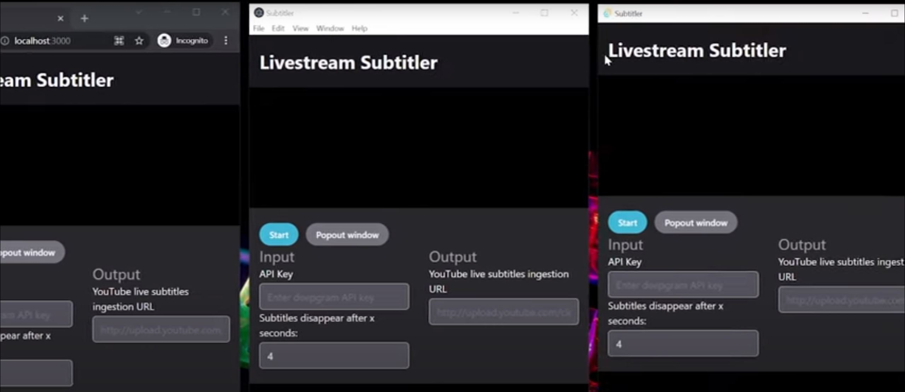

# Live Subtitler

A project to provide an app that live transcribes subtitles / closed captions from your microphone during a YouTube live stream and funnel them to the YouTube subtitle API.

Tauri is used to provide a desktop app wrapper, but it also works in the browser.

